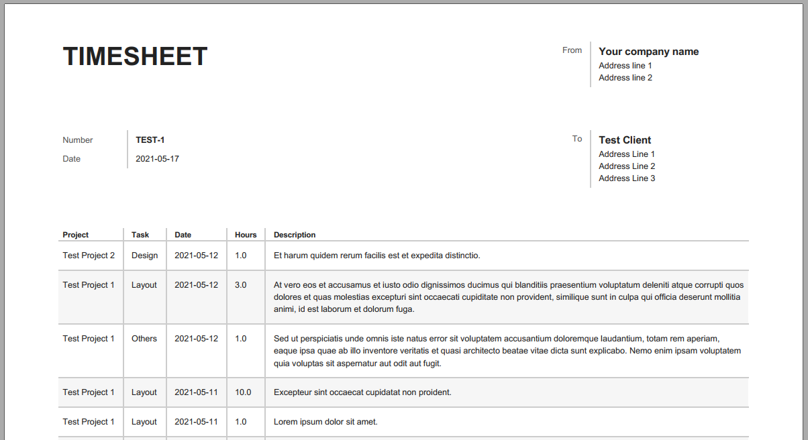

# HarvestReport

Generate timesheet reports from [Harvest](www.getharvest.com) invoices.

The Harvest web interface does not have the option to easily generate reports, stating exactly which time entries are used for a given invoice.

This python script generates a .pdf file, containing a table of each time entrie, linked to an invoice number. The layout of the timesheet report closely resembles the layout of the invoice, such that it can be included with the invoice when sending it the customer.

### Example:



## Getting Started

- Clone the project.
- Run `pip install -r requirements.txt` to install required packages.
- Download the wkhtmltopdf 7-zip achieve and extract the files to `./wkhtmltopdf`
- Set up your `config.ini` file
- Run with `python HarvestReport.py INVOICE` where `INVOICE` is the invoice number.

Use `-h` or `--help` for more options.

### Prerequisites

- Python 3.6+
- wkhtmltopdf present in the project folder inside `./wkhtmltopdf/` 
- A Harvest account with a Personal Access Token for API access. You can get one here if needed: https://id.getharvest.com/developers
- A `config.ini` file in the root folder with the format:

```
[auth]
user-agent = HarvestReport
token = your token
account-id = your account ID

[customizations]
company_name = Your company name
company_address = Address line 1\nAddress line 2

[translations]
number = Number
date = Date
from = From
to = To
project = Project
task = Task
hours = Hours
description = Description
```

## Contributing

Add an issue or fork the project, modify, and file a pull request.

## License

This project is licensed under the MIT license - see the [LICENSE.md](LICENSE.md) file for details.

All .css stylesheets are copied, and modified, from harvest.com, and as such is the sole property of Harvest HQ.